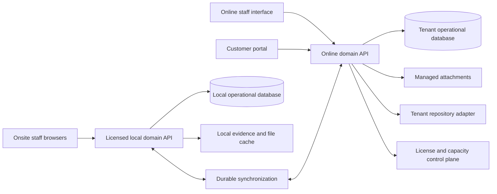
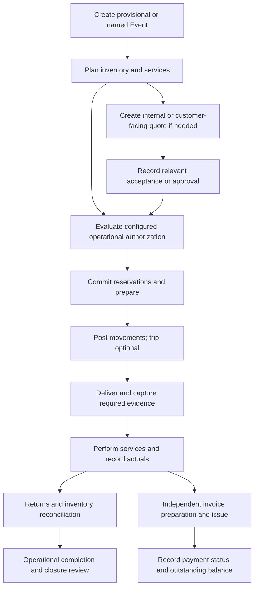

# STRUCTURA
## Product and implementation specification

**Project:** Inventario  
**Version:** 1.3 — consolidated documentation and reference package  
**Prepared:** 29 September 2026  
**Audience:** Product owner, Claude/Codex implementation agents, engineering and QA  
**Status:** Implementation baseline grounded in the latest available conversation and relevant supplied local files. See section 21 for the bounded unrecovered decision fragments.

> STRUCTURA is an event-centered inventory, services and commercial operations platform, delivered through subscriptions and licensing. Its online engine is primary. Its licensed local engine provides the main onsite operations interface through a locally accessible server. Quotes, approvals, inventory movements, deliveries, invoices and payment records support execution without turning STRUCTURA into a full accounting system.

## Contents

1. [Authority, provenance and completeness](#1-authority-provenance-and-completeness)
2. [Product definition and boundaries](#2-product-definition-and-boundaries)
3. [Locked decisions: questions 31–40](#3-locked-decisions-questions-3140)
4. [Requirements catalog](#4-requirements-catalog)
5. [Architecture and deployment](#5-architecture-and-deployment)
6. [Data model and invariants](#6-data-model-and-invariants)
7. [Roles and permissions](#7-roles-and-permissions)
8. [State models and business rules](#8-state-models-and-business-rules)
9. [Operational workflows](#9-operational-workflows)
10. [Cases and use cases](#10-cases-and-use-cases)
11. [Local engine, offline operation and synchronization](#11-local-engine-offline-operation-and-synchronization)
12. [Maps, POIs and routes](#12-maps-pois-and-routes)
13. [Attachments, signatures and photos](#13-attachments-signatures-and-photos)
14. [Customer portal](#14-customer-portal)
15. [Licensing and capacity metering](#15-licensing-and-capacity-metering)
16. [Integrations, imports and exports](#16-integrations-imports-and-exports)
17. [Reporting and calendars](#17-reporting-and-calendars)
18. [API, security and operational contracts](#18-api-security-and-operational-contracts)
19. [Acceptance criteria and testing](#19-acceptance-criteria-and-testing)
20. [Implementation phases and release gates](#20-implementation-phases-and-release-gates)
21. [Non-goals and historical gaps](#21-non-goals-and-historical-gaps)
22. [Implementation-agent handoff](#22-implementation-agent-handoff)
23. [Reference sources](#23-reference-sources)

## 1. Authority, provenance and completeness

### 1.1 Requirement classifications

This document separates business intent from engineering choices. Classification applies to the entire section where stated, unless a paragraph says otherwise.

| Mark | Meaning | Implementation treatment |
|---|---|---|
| **L** | Locked requirement explicitly recoverable from the user's answers or latest clarification | Must preserve; do not reopen as an interview question |
| **F** | Behavior or schema recovered from a relevant supplied local file, retained where consistent with latest user decisions | Implement the retained behavior; do not inherit obsolete platform constraints |
| **R** | Scope explicitly requested in the current documentation brief, with historical details unavailable | Include the module; do not claim its unverified details were previously agreed |
| **C** | Conventional implementation behavior filling a routine functional gap | Use as the implementation baseline, subordinate to recovered user decisions |
| **D** | Engineering design selected in this document | Implement consistently; record any replacement in an architecture decision record |
| **G** | Historical source gap | Do not invent a locked answer; keep affected policy configurable or unreleased |

**Precedence:** latest explicit user clarification → latest relevant project document/workbook behavior → still-applicable earlier explicit user decisions → this document's C/D defaults. Older platform proposals and superseded drafts do not set the current architecture. Prior assistant statements are interpretations, not authority to override the user. In particular, the prior assistant's attempt to soften the full-data-transfer license restriction does not supersede answer 40.

Normative words such as MUST describe the contract within the stated classification. A D contract is an engineering commitment, not a claim that the user chose that design.

### 1.2 Source inventory

| ID | Source | What was actually available |
|---|---|---|
| S1 | Current user implementation-documentation request | Full scope list, no new business requirements, no further questions, market-convention instruction |
| S2 | [Create app requirements questions](https://chatgpt.com/c/6abba139-1e70-83e8-861e-9ef71091bf67) | Reader returned five final exchanges: answers 31–40, financial clarification, quote flexibility, delivery request and an earlier stop exchange; no older-page cursor |
| S3 | [Create Inventory Template](https://chatgpt.com/c/6aa1a499-2740-83e8-bcfd-49f5ae27287c) | Reader returned five final exchanges concerning product photos, inability to create an event and a loading-macro error |
| S4 | Local project `AGENTS.md` and `sources/` inspection | Synced references are read-only; nine sources failed to sync; `sources/` contained no files |
| S5 | Supplied cached conversation preview | Corroborates latest commercial and quote clarifications |
| S7 | Supplied local folders | Latest September 2026 inventory package, workbook schema, current SOP version, import QA findings and migration identifiers; direct links accompany the relevant sections |
| S6 | Official public technical documentation | Supports implementation conventions and map-component feasibility; never substitutes for private project decisions |

An additional attempt to open S2 in the browser reached a logged-out page. The available chat listing exposed S2 and S3 for Inventario but did not provide a complete project-history search. Attached images were not used as evidence of requirements because their business meaning was not available in the text.

**Source selection:** the September 2026 inventory package is the most recent operational prototype found in the supplied inventory folder. Its rules and schema are used below. The latest supplied SOP version and the existing inventory identifiers support operational continuity. Older Odoo/WordPress platform recommendations, setup reports, hosting bills, unrelated event-registration files, games and duplicate drafts are excluded from the current product architecture. Reference copies are included in the delivery; original files remain unchanged.

The nine cloud-project sources still did not sync, and the conversation reader did not expose questions 1–30 or the original prompts behind short answers 32/33/36. These narrow provenance gaps do not invalidate the local operational material now recovered. No older interview or platform choice is required to proceed with the defined baseline.

### 1.3 Change control

Preserve stable requirement IDs and acceptance IDs. Changes to L requirements need explicit new owner direction or a recovered source of higher precedence. Changes to C/D choices require rationale, impact and tests. Recovered decisions replace conflicting defaults; they do not automatically expand unrelated scope. Keep the source gap register in section 21 until reconciled.

## 2. Product definition and boundaries

### 2.1 Product outcome [L/R]

STRUCTURA coordinates event planning and execution across inventory, services, locations, people, delivery evidence and commercial records. An Event may begin internally, without a final customer identity or finalized event name. Internal operational work must not be forced into a customer-sale workflow.

The system provides:

- Inventory creation, search, availability, allocation, movement and tracking.
- Event creation, operational planning, services, delivery and return coordination.
- Optional trips when transport needs recording.
- Event disposition maps with coordinate-based POIs and preferred routes.
- Quotes and estimates, recorded acceptance/approval, invoices and payment status.
- Calendar and financial-operational estimates and summaries.
- Per-record attachments, signatures and simple photographic delivery confirmation.
- A scoped customer portal, audit records, imports/exports and integrations.
- Online and licensed local engines, synchronization and measurable SaaS capacity.

### 2.2 Core distinctions [L]

1. **Movement ≠ Trip.** A location update can be a complete inventory movement without a trip.
2. **Map ≠ Inventory hierarchy.** Event points and routes must not require a newly invented location tree.
3. **Quote ≠ Draft invoice.** A quote is an independent operational/commercial planning record.
4. **Approval ≠ Payment.** An accepted quote, approved operation and paid invoice are different facts.
5. **Tenant invoices ≠ STRUCTURA subscription billing.** Customer event business and platform licensing are separate domains.
6. **Local storage ≠ Unlicensed application access.** The local engine and full data-transfer capability remain licensed.
7. **Operational finance ≠ Accounting core.** Estimates, invoices and payment tracking belong in scope; a general ledger does not.

### 2.3 User experience [C]

Use ordinary create, search, edit, filter, save and confirm actions. Show contextual validation at the record. Preserve entered data after a recoverable failure. Scanning accelerates record identification and confirmation; it is not a substitute for normal UI entry. Provide a visible Create Event action, product-photo upload/preview and meaningful load/save errors, addressing the concrete failures reported in S3 without carrying Excel macro architecture into this product.

## 3. Locked decisions: questions 31–40

The answers are retained below without inventing the absent question wording.

| Answer | Recoverable decision | Consequence and limitation |
|---|---|---|
| 31 | Not every movement requires a trip; movement may be recorded as a location update | `trip_id` is optional; no transport record required to post a basic movement |
| 32 | “Sure,. why not” | **G:** affirmative answer preserved, but its object cannot be recovered; no invented functionality attributed to it |
| 33 | “or a user check/confirmation” | A user confirmation is an accepted mechanism in the discussed context; **G:** original trigger unknown. Do not impose universal signature requirements |
| 34 | If trip/event delivery is marked as requiring photo confirmation, a simple photo suffices | Support an explicit photo-required policy; no mandatory elaborate proof bundle |
| 35 | Event/race-style maps, POIs, coordinates, preferred delivery paths and GPX-style routes; examples include “tarima uno,” mobile toilets and plotaroute | Do not turn POIs into a mandatory inventory hierarchy. Investigate public/open-source components |
| 36 | Existing default accepted; compare with project notes, do not ask again | **G:** default value and subject unavailable; cannot safely name the default |
| 37 | Standard functionality should not need reinvention | Normal UI entry/search/update; scanning may accelerate or follow configured controls. Original question was withdrawn by prior assistant |
| 38 | Attachments at the appropriate record level; avoid unnecessary complexity | Record attachments, not a new paper-document management subsystem |
| 39 | Tenant/customer quoting and invoicing, not the financial core and not a question about subscription billing | Include operational financial capabilities described below; separate platform billing |
| 40 | Subscription plus licensing; primary online engine, secondary local engine, main onsite operations interface; capacity relevant to revenue; externally linked large files; no full transfer without active license, basic CSV/print inventory/tracking allowed | License-aware engines and transfer endpoints, capacity ledger, external repository references and restricted-license export profile |

### 3.1 Subsequent financial clarification [L]

STRUCTURA must provide the ordinary commercial and financial-operational capabilities needed to quote, authorize, deliver, invoice and record payment. Calendar views, financial estimates and recorded quote acceptance are in scope. The implementation must distinguish approval/acceptance from settlement even if the user-facing vocabulary is simplified.

### 3.2 Subsequent quote/invoice clarification [L]

- A quote can be internal only, interdepartmental or customer-facing.
- It may never reach the final customer.
- It can contain only part of what appears on eventual event invoices.
- It can exist under its responsible user or a designation such as **Internal Quote**.
- Final event/customer naming must not be a prerequisite for preliminary commercial records.
- An invoice is a separate record; relevant quote content may be reused, changed, expanded or omitted.
- These capabilities add flexibility; they do not remove quoting, invoicing, approval or payment tracking.

The user's wording also refers to unnamed invoices. Do not require a final customer name merely to create an invoice record. Distinguish internal/draft records from externally issued documents. Any jurisdiction-specific issuance validation is a separate integration/deployment concern, not an inferred prohibition on internal records.

## 4. Requirements catalog

| ID | Requirement | Class/source | Verification |
|---|---|---|---|
| EVT-01 | Create and manage an Event before customer/final designation is known | L, S2 | AT-01 |
| INV-01 | Standard inventory entry, search, updates, allocation and location tracking | L/R, S1/S2 | AT-02–04 |
| INV-02 | Product photos can be saved, reloaded and associated with the right record | R, S3 | AT-05 |
| MOV-01 | Post a movement without a trip | L, S2/31 | AT-02 |
| MOV-02 | Preserve movement history and corrections | R/C, S1 | AT-03 |
| TRP-01 | Optionally group transport-related movements into trips | L, S2/31 | AT-06 |
| MAP-01 | Event POIs, coordinates and preferred paths independent of inventory hierarchy | L, S2/35 | AT-07 |
| EVD-01 | Support user confirmation and configured delivery photos | L, S2/33–34 | AT-08 |
| EVD-02 | Support delivery signatures without making them universal | R, S1 | AT-09 |
| ATT-01 | Attach/upload at the appropriate record level | L, S2/38 | AT-05, AT-10 |
| SRV-01 | Include services in event planning and commercial lines | R/L, S1/S2 | AT-11 |
| COM-01 | Internal/customer-facing quotes with optional customer and partial scope | L, S2 | AT-12 |
| COM-02 | Record acceptance/approval, actor, time and supporting evidence | L, S2 | AT-13 |
| COM-03 | Generate invoices independently of quotes | L, S2 | AT-14 |
| COM-04 | Track unpaid, partially paid and paid amounts/statuses | L/C, S2 | AT-15 |
| COM-05 | Ordinary pricing, taxes, discounts, estimates and outstanding amounts | C, financial clarification | AT-16 |
| PRT-01 | Customer portal bounded by explicit access to customer-facing records | R/D, S1 | AT-17 |
| AUD-01 | Audit material business, access and administrative changes | R/D, S1 | AT-18 |
| ENG-01 | Primary online engine and licensed onsite local server engine | L, S2/40 | AT-19–22 |
| LIC-01 | Active license gates full application/data transfer | L, S2/40 | AT-23 |
| LIC-02 | Basic CSV/print inventory and tracking available without an active license | L, S2/40 | AT-23 |
| CAP-01 | Measurable capacity supporting subscription/licensing revenue | L, S2/40 | AT-24 |
| EXT-01 | Link tenant repositories for large files | L, S2/40 | AT-10 |
| IO-01 | Imports, exports and integration contracts | R, S1 | AT-25–26 |
| REP-01 | Operational calendars and financial/operational reporting | L/R, S1/S2 | AT-27 |
| SEC-01 | Tenant isolation and permission enforcement across all interfaces | D | AT-17, AT-28 |

## 5. Architecture and deployment

**Classification: D implementing ENG-01, LIC-01, ATT-01 and the requested modules. No technology stack was recovered as a locked choice.**

### 5.1 Logical components



- Implement a modular domain application first. Separate module boundaries do not require microservices.
- Share domain validation, permission evaluation and command schemas between online and local engines.
- Use a transactional relational database for movements, reservations, commercial records and audit/outbox transactions; select the concrete engine in the repository ADR.
- Use object storage or a filesystem-backed adapter for managed files, with database metadata. External repository content remains external unless explicitly cached.
- Use a durable worker queue for exports, imports, integration deliveries, file processing and synchronization. Queue retries must be idempotent.
- Keep platform tenant provisioning, subscription entitlements and capacity metering separate from each tenant's customer invoice domain.
- Provide a browser interface served by the local engine on the onsite network. An internet outage must not turn it into a cloud-dependent screen.

### 5.2 Domain boundaries

| Module | Owns | Must not own |
|---|---|---|
| Identity/access | Tenant memberships, grants, sessions | Commercial payment truth |
| Events | Event plan, operational dates, assignments and scope | Inventory balance mutation by direct edit |
| Inventory | Catalog, tracked units, reservations, movement ledger | Invoice settlement |
| Delivery/trips | Delivery work and optional transport grouping | Mandatory prerequisites for all movements |
| Maps | POIs, paths and map references | Forced warehouse hierarchy |
| Services | Planned/performed service lines | Payroll/accounting ledger |
| Commercial | Quote/invoice versions, approvals, payment records, estimates | STRUCTURA subscription charges |
| Attachments | Record links, metadata, storage adapter | Unrestricted public file sharing |
| Sync/local | Command replication, authority and conflict state | Silent override of posted transactions |
| Platform | License entitlements, usage ledger and tenant capacity | Unscoped staff access to tenant operations |

### 5.3 Deployment contracts

Cloud and local installations have explicit deployment IDs, versions and schema compatibility. Local enrollment binds a deployment to one tenant and signed entitlements. Provisioning, upgrade, backup, restore and license renewal must be executable through documented operational procedures. Exact hosting vendor, OS support, installer packaging, cloud region, availability SLA and retention periods are G items, not invented promises.

## 6. Data model and invariants

**Classification: D/C. Entity names and fields below are implementation contracts, not recovered historical schema.**

### 6.1 Shared rules

Use globally unique IDs generated safely offline; tenant-scoped uniqueness constraints; UTC timestamps plus event timezone; fixed-precision quantities and monetary amounts; currency codes on monetary documents; explicit nullable relationships. All cross-entity foreign keys enforce tenant agreement. Ordinary records have `id`, `tenant_id`, `created_at`, `created_by`, `updated_at` and `version`. Posted transactions are immutable and corrected by linked subsequent records.

### 6.2 Entity specification

| Entity | Principal fields / relations | Key invariant |
|---|---|---|
| Tenant | ID, display name, configuration version | Security boundary |
| Membership / PermissionGrant | tenant, user, capabilities, scope | Deny absent grants; no cross-tenant inference |
| Department | tenant, name, active | Optional internal owner grouping, not mandatory organization hierarchy |
| Customer / Contact | display name, contact data, external ID | Optional on early event/commercial records |
| Event | designation, responsible user, optional department/customer, dates, timezone, operational state | Stable ID exists even with provisional name |
| InventoryItem | code, description, unit, tracking mode, active, photo links | Catalog identity is not an individual asset |
| Asset | inventory item, identifier, condition, active | Individual tracking where used; no double current position |
| Location | designation, optional coordinate/reference | No mandatory tree or trip |
| StockPosition | item/asset, location, quantity, ledger version | Derived from committed movements, not free-form edits |
| Reservation | event, item/asset, quantity, time interval, state, authority | Reservation does not move stock |
| Movement | source, destination, occurred time, recorded time, actor, optional event/trip/delivery, correction reference | Positive quantities; atomically posted movement lines |
| MovementLine | movement, item/asset, quantity, unit | Stock changes once per command ID |
| Trip | designation, schedule, optional operational notes, state | No trip required on Movement |
| Trip association | nullable `Movement.trip_id` | One optional Trip per movement in this baseline; grouping never duplicates stock effects |
| Delivery | event/reference, destination/POI, planned/actual quantities, state, evidence policy version | Physical quantities and proof state remain distinguishable |
| DeliveryEvidence | delivery, type, confirmer/signatory label, time, attachment, revision | Supports confirmation, photo or signature as configured |
| EventMap | event, title, map/provider reference, revision | Map content usable independently of inventory location tree |
| POI | event map, label, longitude, latitude, notes | WGS84 coordinate bounds; “tarima uno” is a valid label |
| Route | event map, name, geometry, preferred flag, optional POI references | Ordered path, not an automatic stock transfer |
| ServiceDefinition | name, unit, optional default rate/cost | No stock quantity unless a separate inventory line exists |
| EventService | event, definition, planned/performed quantity, time, responsible user, state | Commercial billing is separate from performance |
| Quote | designation, event optional, responsible user, department/customer optional, audience, currency, revision, status | Internal/partial quote valid without customer |
| QuoteLine | quote version, description, optional item/service reference, quantity, unit price, discount/tax snapshot | Snapshot survives catalog changes |
| Approval | subject type/ID/revision, purpose, decision, actor, time, evidence reference | Approval is attached to the exact accepted revision |
| Invoice | designation, optional event/customer, audience, currency, lifecycle state, issue/due dates | Independent of quote; no compulsory quote ID |
| InvoiceLine | invoice version, description, quantity, price, discount/tax snapshot | May differ from source quote lines |
| CommercialSourceLink | source quote/line, destination invoice/line, copied revision | Traceability without forced one-to-one conversion |
| PaymentRecord | invoice, amount, currency, occurred time, actor, optional reference, reversal link | Records settlement; does not imply bank reconciliation |
| EventCost | event, category/description, estimate or recorded actual, amount, currency, source | Estimated and actual values never silently merged |
| Attachment | parent record, name, type, bytes, checksum, visibility, storage mode/key or external reference, upload state | Parent authorization also governs attachment access |
| AuditEntry | tenant, actor, action, record, before/after or change data, source deployment, times, correlation ID | Append-only through application interfaces |
| LocalDeployment | tenant, deployment ID, version, last sync, public identity | Separate identity from staff account |
| LicenseEntitlement | tenant/deployment, features, capacity settings, valid interval, signature, policy version | Verified server-side and locally |
| UsageEntry | unique event ID, tenant, metric, amount, unit, period, deployment, reconciliation state | Retry-safe consumption accounting |
| SyncCommand | command ID, aggregate/version, payload version, authority, actor, state, error | Durable acknowledgment; duplicates return original result |
| ImportJob / ExportJob | scope, mapping/profile, state, counts, row errors, license decision | Partial result explicit; no success on failed output |
| IntegrationConnection | tenant, adapter, credential reference, scope, state | Secrets outside ordinary record payloads |

### 6.3 Cardinality and ownership

An Event can have many reservations, movements, deliveries, services, maps, quotes and invoices. Quotes/invoices need not have an Event until one is assigned; this is a C flexibility default. Each commercial document belongs to one tenant and currency. Many source-line links support partial or consolidated invoicing without coupling document lifecycles. A trip groups zero or more planned/posted movements, but posting a trip must not independently post its movements again.

### 6.4 Retained catalog and stock behavior [F]

The [current inventory workbook](<STRUCTURA_References/Local_Files/S7b_27TS_Inventario.xlsm>) has distinct catalog, Event, rental-line and movement tables. Preserve its business fields without copying its single-user spreadsheet limitation:

- Catalog: internal ID, name, internal reference, responsible person, barcode, sales price, category, initial quantity, product type, unit, active flag, photo filename/reference, base location, notes and original exception data. Brand/model can remain editable catalog metadata as described by the guide.
- Product types: rentable, consumable and spare part. These are different from quantity-versus-individual tracking mode.
- Stock views: total currently owned, currently out at Events, in repair and available in warehouse. Quantity changes use movements, not edits to calculated totals.
- Preserve category paths for classification. Category hierarchy is not the rejected mandatory map/location hierarchy.
- Event dates: event date, departure date, expected return and actual closure; preserve responsible person and notes.
- Rental-line reconciliation: requested, returned usable, consumed, sent to repair and outstanding quantities.

Extend `InventoryItem` with these catalog attributes, `Event` with the separate dates, and introduce `EventInventoryLine(event_id, item_id, requested_qty, unit, notes)` plus `ReturnAllocation(line_id, movement_id, outcome, quantity)`. Derive cumulative outcomes from posted allocations. Link reservations and dispatch lines to the Event inventory line. Track planned quantity separately from cumulative actual dispatch. Physical outstanding quantity equals actual dispatch minus reconciled usable/consumed/repair allocations; reserved-but-undispatched quantity is a separate plan remainder. Close rental fulfillment only after dispatched stock and any unused plan/reservation remainder are resolved. Do not store several independently editable copies of the same stock total.

### 6.5 Inventory consistency

- A confirmed movement subtracts from the source and adds to the destination atomically. Receipts, losses and adjustments use explicit movement reasons and balancing endpoints rather than unexplained edits.
- Serial-tracked assets move as individual units; quantity-tracked stock uses decimal quantities appropriate to its unit. Tracking modes are C defaults pending earlier inventory specifications.
- A reservation affects availability in its time interval, not physical location. Preserve the latest prototype's inclusive rental dates: departure through expected return, including both days. A return planned for day 14 remains reserved on day 14 and is available for another planned rental from day 15. Internally represent this as `[departure-day start, day-after-return start)` in the Event timezone. Do not substitute same-day turnover without an explicit later policy.
- The recovered F baseline rejects commitments exceeding known availability and posts no silent negative stock. Offline uncertainty must be visible. Any previously agreed overbooking/negative-stock policy takes precedence when recovered.
- A posted movement cannot be deleted to erase an error. Record a compensating movement with a reason and original reference.
- Cancelling an Event releases unused reservations but never deletes delivered-stock history or marks outstanding returns as received.

## 7. Roles and permissions

**Classification: R for permissions scope; D for the following capability-based design and role presets. Historical role names were not recovered.**

Use capabilities plus tenant, event and record scopes. Role presets are convenience bundles that can be adjusted; do not hard-code user titles into authorization.

| Preset | Baseline authority | Boundaries |
|---|---|---|
| Platform operator | Manage tenants, license entitlements, aggregate usage and deployments | No automatic permission to read tenant commercial/files content |
| Tenant administrator | Manage memberships, settings and module grants | Cannot bypass active-license checks or alter audit history |
| Operations manager | Plan events, allocations, movements, delivery and services within scope | Commercial approval/export rights require grants |
| Inventory operator | Catalog lookup, assigned preparation, movement/return commands | No implicit pricing, license or membership authority |
| Delivery/onsite user | Assigned deliveries, POIs/routes, confirmation/photo/signature capture | No general access to all customers or commercial records |
| Commercial user | Quotes, invoices, recorded payments and estimates | Operational or approval capabilities granted separately |
| Viewer/auditor | Read authorized records/history, permitted reports | No business mutation; export is a separate grant |
| Customer portal user | Explicitly shared customer-facing records and allowed actions | No internal quotes, costs, other customers or staff records |

Key capabilities: `event.manage`, `inventory.manage`, `reservation.commit`, `movement.post`, `movement.correct`, `delivery.confirm`, `map.edit`, `service.manage`, `quote.manage`, `quote.approve`, `invoice.issue`, `payment.record`, `attachment.manage`, `portal.share`, `report.read`, `export.basic`, `export.full`, `audit.read`, `tenant.admin`, `deployment.manage`.

Evaluate permissions on every command, query, file download, background job and synchronization replay. An invoice link or attachment ID must not confer access. Snapshot offline authorization only within a signed validity interval; section 11 defines reconciliation of revoked access.

## 8. State models and business rules

**Classification: C/D state vocabulary implementing L distinctions. Earlier state names may replace labels without collapsing separate facts.**

### 8.1 Event and operations

Preserve the source rental-fulfillment states: `draft → confirmed → delivered → partial_return → closed`, with `cancelled` only before dispatch. Approval/authorization and service execution remain separate facets; they must not replace these inventory states. Completion means operational work completed; closure means reconciliation reviewed. Unpaid invoices remain visible after operational completion. A bare status edit must not move stock or settle invoices. The explicit dispatch command atomically posts actual outbound quantities and updates fulfillment status; return-processing commands update it from reconciled quantities.

Reservations: `draft → committed → released/fulfilled/cancelled`. Movement: `draft → posted`; posted movement corrections are new records. Trip: `planned → in_progress → completed`, or `cancelled`. These are independent state machines.

Deliveries track planned, dispatched and received quantities separately, with `pending`, `partial` and `complete` operational outcomes and a separate proof-completeness flag. A failed photo upload does not make physically moved inventory disappear.

### 8.2 Quotes and approvals

Quote states: `draft`, `ready`, `accepted`, `declined`, `cancelled`, `superseded`. Audience is separately `internal` or `customer_facing`; publication/sharing is explicit and must not follow automatically from audience selection.

Acceptance records its context (`internal_approval` or `customer_acceptance`), exact revision, actor/represented party, time and supporting record. An accepted quote may enable operational authorization under configured policy. There is no universal rule requiring a customer-facing quote, payment or invoice before every movement.

Editing accepted commercial content creates a revision. Previous acceptance remains historically valid for its accepted content but cannot silently approve revised quantities/prices. Operational authorization retains the accepted revision it relied upon.

### 8.3 Invoice and payment states

Keep invoice lifecycle (`draft`, `issued`, `cancelled`) separate from payment state (`unpaid`, `partially_paid`, `paid`) and from approval records. `Overdue` is a derived flag on an issued invoice with positive outstanding balance past its due date. It is not an alternative payment amount.

For a single-currency invoice:

```text
net_line = quantity × unit_price − line_discount
invoice_total = sum(net_lines) + calculated_taxes − document_discount
recorded_paid = sum(valid_payment_records) − sum(linked_reversals)
outstanding = invoice_total − recorded_paid
```

The tax/discount calculation order, inclusive/exclusive tax mode and rounding policy must be explicit and versioned. Implement decimal arithmetic; do not calculate currency with binary floating point. No jurisdiction-specific rules or currency conversion policy are asserted here.

“Mark paid” is a convenience command that records the outstanding settlement amount and an audit entry. Duplicate submission cannot record payment twice. Partial payment requires an amount. Corrections create reversals; issued documents and historical settlement records are not silently rewritten. Unsupported overpayments receive a clear validation result rather than a fabricated accounting treatment.

### 8.4 Operational authorization

Implement named, versioned predicates such as `accepted_quote_required` and explicit internal approval. A delivery evaluates its effective policy and reports exactly what is missing. Payment is not an implicit prerequisite merely because payment tracking exists. Do not invent tenant policy values for answer 36: configurable mechanisms can be implemented while the unrecovered historical default remains marked G.

## 9. Operational workflows

### 9.1 Event planning through closure



This diagram illustrates a common sequence, not a mandatory invoice-after-delivery restriction. Quote creation and customer billing can be absent for internal work. Approval gates follow configured policy. Invoicing/payment timing can differ without rewriting inventory history.

### 9.2 Simple location update

1. Search/select item or asset through normal UI or optional scan.
2. Choose source/destination and quantity; Event and Trip references are optional.
3. Validate permission, current position, quantity, authority and expected version.
4. Post the movement atomically with audit and synchronization record.
5. Show the new location/balance and movement receipt.

No driver, vehicle, route, trip or customer record is necessary for this case.

### 9.3 Optional trip and event delivery

Create a Trip only when transport grouping is useful. Associate the relevant deliveries/movements, select event POIs/preferred route if useful, record execution and capture effective evidence requirements. A partial delivery posts only the actual quantities and leaves the remainder open. Completing a Trip cannot imply every grouped delivery succeeded.

### 9.4 Internal quote to distinct invoice

Create **Internal Quote** under a responsible user/department with optional Event and no customer. Add known inventory/service lines and estimates. Record internal approval if required. Continue execution. If billing is needed later, create a separate invoice, optionally copying selected quote lines with provenance. Add/remove/change invoice lines without changing the accepted quote snapshot. Assign customer/final designations when known; never auto-publish the internal quote.

### 9.5 Return and reconciliation

Record each outstanding line across **usable return**, **consumed**, and **sent to repair**. Their sum cannot exceed the outstanding quantity. Usable returns enter available stock; consumed quantities permanently reduce inventory; repair quantities remain owned but unavailable. Remaining units stay outstanding and produce `partial_return`; all dispatched quantities processed and any unused plan/reservation remainder resolved produce rental fulfillment `closed`, independently of invoice payment or remaining service work. Repair-to-stock and write-off-from-repair are explicit movements. Consumables may return fully, partly or not at all. These behaviors come from the [September 2026 operating guide](<STRUCTURA_References/Local_Files/S7a_README_27TS_Inventario.md>).

### 9.6 Service execution

Plan a service line with quantity/unit, schedule and estimate. Record performance or cancellation with actual quantity/cost where known. Include services on a quote or invoice as needed. Service completion does not move physical stock; related equipment is handled by explicit inventory movements. This does not introduce payroll, employee timekeeping or a procurement suite.

### 9.7 Import

Upload a supported file, map fields, preview records, validate references/units/duplicates and show row errors. Commit the selected valid batch under an explicit import job. Preserve source row references. A failed batch leaves no hidden half-posted movement. Re-running the same job must not duplicate assets or transactions. The inspected workbook mapping is defined in section 16.1. Do not execute its macros during import.

### 9.8 Physical count and administrative validation [F]

The [current SOP v0.2](<STRUCTURA_References/Local_Files/S7c_PROCEDIMIENTO OPERATIVO ESTÁNDARv0.2.docx>) separates warehouse/door capture from inventory-manager validation. Retain this useful workflow: planned quantities → captured actual quantities → discrepancy review → authorized posting. A captured count alone is not a posted movement. Store count-session ID, operation direction, operator, capture time, product/asset, actual quantity and source file where applicable; link the validated movement back to the session.

The SOP's Odoo dependency, scan-only rule and universal confirmed-sales-order starting point are superseded by the latest STRUCTURA local-engine, manual-entry and internal-quote clarifications. Repeated scans may increment quantity for bulk items; individual asset identifiers must flag accidental duplicate scans. A CSV/Excel count upload follows the same review and posting path. The permissions model allows door operators to capture while an inventory manager posts, without requiring every tenant to use that separation.

## 10. Cases and use cases

Each case has its own implementation document, including actors, preconditions, inputs, workflow, data effects, failure handling, local-engine behavior and acceptance criteria. These documents form part of this specification; they do not define independent or conflicting policies.

[Open the complete use-case index](<STRUCTURA_Use_Cases/README.md>) · [Read the shared integration contract](<STRUCTURA_Use_Cases/INTEGRATION_CONTRACT.md>)

Cases labeled “source case” were recoverable from the cited material. “Derived test case” exercises the design and must not be presented as prior discussion. The shared contract defines consistent command handling, inventory quantities, permissions, evidence, synchronization and licensing across all 25 documents.

| Case document | Basis | Expected behavior |
|---|---|---|
| [UC-01 — Internal departmental estimate without final customer](<STRUCTURA_Use_Cases/UC-01_Internal_Quote.md>) | Source case, S2 quote clarification | Owner/designation sufficient; no compulsory recipient or invoice conversion |
| [UC-02 — Quote contains only part of eventual event bill](<STRUCTURA_Use_Cases/UC-02_Independent_Invoice.md>) | Source case, S2 | Invoice adds/removes/consolidates lines; quote history stays intact |
| [UC-03 — A normal inventory location change](<STRUCTURA_Use_Cases/UC-03_Location_Movement.md>) | Source case, S2/31 | Post without Trip; history records source, destination and actor |
| [UC-04 — Transport is worth documenting](<STRUCTURA_Use_Cases/UC-04_Optional_Trip.md>) | Source case, S2/31 | Optional Trip groups operations without changing movement fundamentals |
| [UC-05 — “tarima uno” and mobile toilets on an event map](<STRUCTURA_Use_Cases/UC-05_Event_Map.md>) | Source case, S2/35 | Independent POIs with coordinates; preferred route visible without location hierarchy |
| [UC-06 — Photo-required event/trip delivery](<STRUCTURA_Use_Cases/UC-06_Delivery_Photo.md>) | Source case, S2/34 | A simple valid uploaded photo satisfies the photo requirement |
| [UC-07 — User checks/confirms completion](<STRUCTURA_Use_Cases/UC-07_User_Confirmation.md>) | Source fragment, S2/33 | Confirmation supported; exact original trigger remains G |
| [UC-08 — Normal UI operation without scanning](<STRUCTURA_Use_Cases/UC-08_Manual_Inventory_UI.md>) | Source interpretation, S2/37 | Search/select/update available; no mandatory barcode architecture |
| [UC-09 — Attach a file to its operational record](<STRUCTURA_Use_Cases/UC-09_Record_Attachment.md>) | Source case, S2/38 | Parent-scoped attachment, no separate paper-document process |
| [UC-10 — Large file stays in customer repository](<STRUCTURA_Use_Cases/UC-10_External_Repository_File.md>) | Source case, S2/40 | Store authorized external reference and metadata; avoid mandatory managed copy |
| [UC-11 — Local installation with inactive license](<STRUCTURA_Use_Cases/UC-11_Inactive_License.md>) | Source case, S2/40 | Full transfer denied; basic inventory/tracking CSV/print remains available to authorized user |
| [UC-12 — Product photo disappears or wrong product reloads](<STRUCTURA_Use_Cases/UC-12_Product_Photo_Reload.md>) | Source case, S3 | Save/reload retains correct photo; failures explain the action that failed |
| [UC-13 — No visible way to create an Event](<STRUCTURA_Use_Cases/UC-13_Create_Event.md>) | Source case, S3 | Direct Event creation is available to permitted staff |
| [UC-14 — Internet fails during a movement](<STRUCTURA_Use_Cases/UC-14_Offline_Movement.md>) | Derived test case | Durable local posting within authority; retry sync does not duplicate stock effects |
| [UC-15 — Two disconnected engines reserve the same asset](<STRUCTURA_Use_Cases/UC-15_Competing_Inventory_Commitment.md>) | Derived test case | Authority rules prevent competing final commitments; proposed conflict remains visible |
| [UC-16 — Acceptance followed by quote edit](<STRUCTURA_Use_Cases/UC-16_Revise_Accepted_Quote.md>) | Derived test case | New revision; original acceptance never implicitly covers changed content |
| [UC-17 — Customer follows another customer's URL](<STRUCTURA_Use_Cases/UC-17_Portal_Access_Isolation.md>) | Derived test case | Denied, including attachments, exports and aggregate queries |
| [UC-18 — Partial delivery and partial return](<STRUCTURA_Use_Cases/UC-18_Partial_Delivery_Return.md>) | Derived test case | Quantities conserved; unfinished remainder remains visible |
| [UC-19 — Payment entered twice due to retry](<STRUCTURA_Use_Cases/UC-19_Payment_Retry.md>) | Derived test case | One payment, one balance change; original result returned |
| [UC-20 — License expires with pending local commands](<STRUCTURA_Use_Cases/UC-20_License_Expiry_With_Pending_Sync.md>) | Derived test case | Existing data preserved, clear restricted mode, licensed features blocked per effective entitlement |
| [UC-21 — Inclusive return-day reservation](<STRUCTURA_Use_Cases/UC-21_Inclusive_Reservation_Dates.md>) | Source case, latest local guide | Return day stays reserved; following-day availability still respects actual outstanding stock |
| [UC-22 — Consumable partly returned, partly used](<STRUCTURA_Use_Cases/UC-22_Consumable_Return_Allocation.md>) | Source case, latest local guide | Usable portion returns; consumed portion reduces owned stock; remainder stays pending |
| [UC-23 — Equipment returned damaged, later repaired](<STRUCTURA_Use_Cases/UC-23_Repair_And_Return_To_Stock.md>) | Source case, guide/SOP | Repair excluded from availability; explicit repair-return restores stock |
| [UC-24 — Import pop-up dismissed and identical file rerun](<STRUCTURA_Use_Cases/UC-24_Reliable_Inventory_Import.md>) | Source case, SQA report | No silent interruption or duplicate records; persistent job and explicit result |
| [UC-25 — Door count differs from planned dispatch](<STRUCTURA_Use_Cases/UC-25_Dispatch_Count_Reconciliation.md>) | Source case, SOP v0.2 | Discrepancy review before posting actual quantities; retain plan and captured facts |

The full earlier historical case collection remains unavailable. This set documents every case in the current Section 10 without claiming otherwise.

## 11. Local engine, offline operation and synchronization

**Classification: L for deployment intent; D for synchronization mechanics.**

### 11.1 Operating modes

| Condition | Behavior |
|---|---|
| Online, valid entitlement | Cloud functionality according to permissions and entitlement |
| Onsite LAN, internet connected | Staff use local server; durable local commands synchronize |
| Onsite LAN, internet unavailable, valid offline entitlement | Authorized cached operations continue within local authority; cloud freshness visible |
| Browser cannot reach its local server | Show unavailable state; do not claim a command was saved |
| License not active or offline entitlement expired | Restricted mode, preserved records, basic permitted CSV/print; no full transfer |
| Synchronization conflict | Preserve both evidence and pending command; expose reason and resolution workflow |

A standalone fully offline browser/mobile database is not promised by the recovered local-server requirement. It can be a future design only if separately supported. Local server availability and internet availability are different conditions.

### 11.2 Command and durability contract

Each mutation carries `command_id`, tenant, deployment, actor, aggregate ID, expected version, payload schema version, occurrence time and entitlement/authority references. Persist domain change, audit entry and outbox item in one transaction. Respond “saved locally” only after commit. Cloud acknowledgment identifies the same command and resulting version. Retrying a command with a changed payload under the same ID fails validation.

Sync states: `pending`, `sending`, `acknowledged`, `conflict`, `rejected`. Upload media separately with checksums and resumable state; a record cannot report its evidence as remotely available before the file is actually acknowledged. Expose counts, last successful sync and actionable failures.

### 11.3 Authority and conflicts

Cloud is the canonical converged store, but must not compete silently with a delegated local writer. Use an explicit authority scope/epoch for inventory resources or event allocations. During local delegation, cloud and other deployments cannot finally commit overlapping stock from the same scope. They may retain proposals awaiting authoritative validation. Transfer authority only through an acknowledged handover after pending commands reconcile; outage failover is a controlled recovery procedure, not automatic lease stealing.

Metadata updates use optimistic concurrency with a human-readable conflict. Posted movements, approvals and payments never use last-write-wins. Append-only evidence can merge by ID, but each file still requires validation. Cancellation racing with delivery cannot delete a delivery; flag the conflict for reconciliation. A cloud rejection must not erase the local record of what staff actually did.

These choices trade immediate multi-writer availability for inventory integrity. Offline clients cannot guarantee global availability they have not observed. Show scope, freshness and provisional status explicitly.

### 11.4 Authorization, time and recovery

Locally validate signed entitlements and cached scoped grants. Online revocations cannot reach a disconnected server immediately; bound this exposure through entitlement validity. Exact duration/grace values were not recovered and must be configuration supplied with licensing policy, not a hard-coded commercial promise.

Keep occurred time, local recorded time and cloud received time. Track last trusted server time and detect clock rollback rather than extending license validity from an editable clock. Encrypt credentials and managed data where appropriate; back up local database plus referenced managed evidence. Recovery must restore pending command IDs and acknowledgment state to prevent duplicates. Never purge customer records on license expiration.

## 12. Maps, POIs and routes

**L functional model:** the event map is a disposition/operations map with points and paths. A POI can identify a stage, mobile toilets or any delivery point by a label and coordinates. A preferred route can follow the event layout. No compulsory nested site/zone/location hierarchy.

**D baseline:** use GeoJSON Point and LineString internally, with an adapter for GPX waypoint/track/route import/export. Preserve segment breaks and point order; validate longitude/latitude ranges and reject malformed geometry. Retain source file provenance. GPX interchange is a technical realization of the GPX-style requirement, not a recovered exact format contract.

Leaflet is a candidate rendering component because its official API supports GeoJSON layers, markers and paths. It is not a route-optimization service. [Leaflet reference](https://leafletjs.com/reference)

Cache event geometry and permitted local map assets for onsite use. A map renderer does not imply unlimited free basemap hosting. The public OpenStreetMap raster tile service prohibits bulk/offline downloading; use a provider permitting offline use or self-hosted tiles for that requirement. Provider selection remains replaceable. [OpenStreetMap tile policy](https://operations.osmfoundation.org/policies/tiles/)

Manual preferred-path editing and stored paths suffice for the confirmed requirement. Automatic routing, live vehicle tracking, geofencing and delivery optimization are not inferred. Do not require live GPS permission to manually enter coordinates. A map change does not relocate stock; a movement to a mapped destination is an explicit operation.

## 13. Attachments, signatures and photos

**L:** attachments belong to records; simple photo confirmation must remain simple. **R:** delivery signatures. **D:** validation and storage controls below.

An attachment is either managed content or an external repository reference. Record original filename, content type, measured size, checksum when available, uploader, time, parent and visibility. Upload status is explicit: pending, available, failed or removed. Authorize preview/download through the parent; never leak a permanent unrestricted storage URL.

Each delivery has a snapshotted effective evidence policy. Explicit delivery settings take precedence over a trip's settings, then an event's settings, then a configured tenant default; this precedence is D, not recovered answer 36. Configuration represents confirmation, photo and signature requirements independently. Do not default every option to required. Missing historical default values remain G.

- A required photo is satisfied by one valid available photo unless a recovered requirement says otherwise. Do not add compulsory GPS, facial recognition, multiple angles or metadata certification.
- A user confirmation records identity, time and the action confirmed.
- A signature stores the captured mark or equivalent artifact, signatory label, time and the delivery revision it acknowledges. It is evidence of the recorded acknowledgment; no legal-certification claim is made.
- Evidence is not overwritten after acceptance. Corrections append a new version/reference with audit history.
- Offline capture can satisfy local evidence completeness after durable local storage. The UI separately shows pending cloud upload.
- A broken external file reference remains visible with its parent; it does not silently delete historical evidence.

Validate file type by content as well as extension, enforce configured byte limits before final acceptance, and reject executable/untrusted content from inline rendering. Use resumable uploads where useful. External repository credentials stay in a credential store and follow least scope. A repository link is not evidence that STRUCTURA controls the external file's availability or access policy.

## 14. Customer portal

**R scope with D minimum design; earlier portal commitments were not recovered.**

Provide authenticated, explicitly granted access to selected customer-facing event information, quote revisions, invoice/payment summaries and permitted attachments. Internal-only quotes, internal costs and departmental notes are excluded from portal queries and exports. Assigning a customer to an Event does not retroactively publish every attached record.

Where enabled, a customer may accept the exact shared quote revision; store represented party, authenticated identity, decision time and evidence. Portal acceptance does not mark an invoice paid. Staff may record externally obtained acceptance with its source. Do not assume customers can change inventory, approve internal operations, upload unrestricted content or pay online.

Sharing and revocation are auditable. Reject cross-customer access even within one tenant. Account invitation/password flow, branding, online payment gateways, public links and customer self-service ordering are not historically verified requirements and are not added to the baseline.

## 15. Licensing and capacity metering

### 15.1 Commercial boundary [L]

STRUCTURA sells subscriptions and licenses. Its tenant customers may separately quote and invoice their own customers. These balances, documents and statuses must never be conflated.

Large-file repository linking should support revenue and cost control, rather than making the platform responsible for all large-file storage. No subscription prices, plan names, quotas or overage rates were recovered; do not invent them.

### 15.2 Entitlements and restricted mode [D implementing L]

| Operation | Active, entitled license | Inactive/expired license |
|---|---|---|
| Licensed operational features | Available within grants | Restricted by entitlement; baseline disables new operational mutation |
| Full schema/relationship export or deployment transfer | Available only if feature and user permitted | Denied |
| Basic inventory/tracking CSV and print | Available to authorized users | Remains available to authorized users |
| Local engine unrestricted operation | Valid signed local entitlement required | No automatic unrestricted access |
| Existing stored records | Preserved | Preserved; no expiry deletion |
| License renewal/diagnostics | Available | Available |

Basic export is an explicit projection of ordinary inventory and tracking records: item/asset identifiers, descriptions, units, quantities, locations and movement dates/references, with permitted actor identifiers. It excludes a complete portable application bundle of relational schema, workflow configuration, users/credentials, integrations and managed binary content. Full exports include the wider relational package only while active and authorized. Neither query pagination nor generic API access may become an accidental bypass of the restricted-mode policy.

Enforce license decisions in domain services, jobs, sync and transfer endpoints, not merely by hiding buttons. Signed manifests and application-managed local storage can enforce supported workflows. They cannot make extraction mathematically impossible for a person who fully controls the host and has seen decrypted data. This is an engineering limitation, not a weakening of the specified product restriction. Do not claim an undocumented schema or encryption alone guarantees impossibility.

### 15.3 Capacity ledger [D]

Meter technically measurable units separately from commercial prices. Candidate dimensions are managed bytes stored, bytes transferred, active deployments, active users and processed records/operations. These are candidate meters, not invented billable plans. External-file metadata and cached bytes must be differentiated from remotely held file size.

Use immutable usage event IDs, metric definitions and period boundaries; deduplicate retries; reconcile local accumulated usage after connectivity returns. Derived storage gauges must account for replacement/deletion according to the chosen billing policy. Do not double-charge cloud ingestion of a local usage event. Display measured values, delayed/unreconciled state and configured limits to platform management; tenant-facing summaries follow grants.

Capacity rejection must happen before accepting new managed bytes or a new restricted operation, with a clear reason. Existing record readability and basic exports must not disappear merely because capacity is exhausted. Pricing, soft/hard limit behavior and offline overage rules remain G policy fields; do not silently make billing promises.

## 16. Integrations, imports and exports

**R overall scope; L external repositories and basic/full export distinction; D interfaces.**

Provide adapters around external storage, map providers and future accounting/commercial connectors. Mention of Odoo is a convention reference, not a requirement to integrate with Odoo or implement its accounting modules.

| Interface | Baseline contract |
|---|---|
| Inventory CSV import | Explicit field mapping, encoding/unit validation, duplicate policy preview and row-level results |
| Operational CSV import | Validate referenced records and dates; post through normal commands, never bypass movement ledger |
| Inventory/tracking CSV export | Stable documented columns, permission filtering, date/scope filters, restricted-license profile |
| Printable records | Human-readable inventory/tracking and commercial output; provisional designations supported |
| Full application export | Versioned manifest, relationships, scope and attachment references; active-license and export grant checks |
| GPX/GeoJSON | Validated map interchange with coordinate/path-order preservation |
| External repository | Resolve/store reference, obtain authorized content where permitted, report unavailable/expired access |
| Future webhook/API integration | Versioned event ID, tenant scope, authentication, idempotency, retry status and dead-letter handling |

Export permissions are separate from view permissions. Recheck authorization/license at job execution and download, not only at job creation. CSV output must prevent spreadsheet formula injection. Imports must never execute macros from a legacy workbook. The current prototype workbook was inspected read-only; use the source-backed mapping in section 16.1. Macro execution and Excel deployment are not part of STRUCTURA migration.

Keep immutable source IDs and import provenance for migrated records. Never treat imported customer invoice status as proof of a bank payment unless an explicit payment record is supplied and validated. Integration failures show a retryable/error state instead of claiming external success.

### 16.1 Source-backed workbook mapping [F/D]

Use the [September 2026 workbook](<STRUCTURA_References/Local_Files/S7b_27TS_Inventario.xlsm>) as the latest inspected prototype. Its formatted row capacity is not the actual record count. Blank/formula-only rows are not imported as records.

| Source table and field | Destination / handling |
|---|---|
| Productos: ID Producto | Immutable legacy source key; map to new internal ID |
| Nombre, Referencia interna, Código de barras | Name, internal reference and barcode text; preserve leading zeros |
| Responsable, Categoría de producto, Tipo de producto, Unidad, Activo | Resolve tenant-scoped catalog metadata and unit/type values |
| Precio de venta | Preserve source value/provenance; do not assume historical placeholder prices are approved current rates |
| Cantidad inicial | Opening balance movement at the migration baseline date; never also load calculated totals as another receipt |
| Archivo de foto | Resolve relative to the package Images folder through an import manifest; missing image is a row warning |
| Ubicación base, Notas, Dato de excepción original | Base location, notes and retained uninterpreted legacy metadata |
| Total actual, Alquilado actualmente, En reparación, Disponible en almacén | Reconciliation expectations, not independent mutable quantities |
| Eventos: ID Evento and descriptive/date fields | Event legacy key, provisional/final designation, location, event/departure/expected-return/closure dates, responsible person and notes |
| Detalle Alquiler: ID Línea, ID Evento, ID Producto, Cantidad solicitada | EventInventoryLine plus source-key links |
| Devuelto, Consumido, A reparación, Pendiente | Compare to reconstructed movement/return history; avoid double posting aggregate values |
| Movimientos: ID Movimiento, Fecha y hora, Tipo, ID Producto, ID Evento, Cantidad, Desde, Hacia, Usuario, Notas | Movement history with explicit type mapping, timestamp interpretation and actor provenance |

Choose either full opening-plus-history reconstruction or a dated balance snapshot plus retained read-only legacy history for each migration job. Never combine both as stock effects. Validate computed stock against source totals before committing. Preserve unmapped source fields as clearly labeled migration metadata, not invented business meanings.

The [November 2025 inventory export](<STRUCTURA_References/Local_Files/S7e_Inventario en sistema (Referencia Interna y Barcodes)_17-Nov-2025.xlsx>) is useful for legacy identifiers and column compatibility, but must not overwrite the newer workbook's quantities. Its fields include internal reference, barcode, product category, actual/forecast quantity, price/cost and unit. Do not identify a product solely by name; the inspected older import template contains repeated names in different categories.

### 16.2 Import failure prevention [F]

The [inventory import QA report](<STRUCTURA_References/Local_Files/S7d_Reporte SQA_Interface de carga de inventario.docx>) reports two concrete defects: clicking outside the progress pop-up silently interrupted loading, and repeated file loads created duplicate products with different quantities. The replacement must persist the job independently of its dialog, show processed/failed totals and allow reconnecting to job status. Closing a dialog is not cancellation.

Use a tenant + source-system + source-key identity mapping. Reimporting a catalog snapshot updates mapped metadata rather than creating duplicate products. Adding stock is a separate movement-import intent with its own unique transaction references; never silently add the same snapshot quantity twice. Name-only matching is insufficient. Explicit cancellation reports committed scope and remaining rows; transactional batches are visible.

### 16.3 Barcode continuity [F/D]

The [legacy barcode specification](<STRUCTURA_References/Local_Files/S7f_27ts Barcode Specification.docx>) and [implementation guide](<STRUCTURA_References/Local_Files/S7g_27TS barcode Excel Implementation Guide.docx>) are references for existing labels, not a global STRUCTURA numbering requirement. Their category mappings and sequence descriptions differ, so preserve actual existing barcode strings and validate rather than regenerate them from descriptions or row positions.

Store identifiers as text; keep internal reference distinct from barcode and individual serial identity. Flag duplicate/invalid barcodes with the affected source rows. Do not silently strip leading zeros, change labels after a category edit or use spreadsheet row number as the new permanent identity. Tenant-specific generation can be an adapter if needed; no hard-coded 027 prefix for all subscribers. Scanning remains optional under the latest user answer.

## 17. Reporting and calendars

**L calendar/financial estimates; R reporting; C report definitions.**

Provide calendar views of Event schedules, reservations, expected departures/returns, deliveries and invoice due dates. Filter by accessible Event, responsible user, location and operational state. Timezone conversion must not change stored execution instants. Pending local data shows freshness indicators.

Operational reports include current stock by location, event allocation/availability, movement history, outstanding deliveries/returns, evidence completeness, service execution and synchronization exceptions. Commercial reports include quote status, accepted value, invoiced value, recorded payments and outstanding balances.

Financial summaries keep estimated revenue, estimated cost, recorded actual cost and invoiced revenue separately labeled. Show estimated margin as estimated revenue minus estimated cost; show margin percentage only with a valid nonzero denominator. Do not label a partial-cost calculation as final realized profit. Payment collection is distinct from revenue. Do not aggregate different currencies without an explicit conversion policy; present separate currency totals instead.

Reports and exports use the same permission model as their underlying records. Totals must not leak hidden rows. Every summary shows applicable filters, currency, time range and whether unsynchronized/local records are included. No bank reconciliation, statutory accounts or general ledger reports are implied.

## 18. API, security and operational contracts

**Classification: D.**

### 18.1 Command surface

Implement equivalent versioned endpoints/handlers for Event creation, reservation commit/release, movement post/correct, delivery confirmation/evidence, quote revision/acceptance, invoice issue, payment record/reverse, attachment upload/reference, import/export jobs and local sync. Exact URL naming is repository-specific.

Commands return a record ID, committed version, command ID and persistence/sync state. Errors distinguish validation, permission denial, license restriction, stale version, insufficient availability, missing evidence, external provider failure and schema incompatibility. An HTTP success or UI toast is not enough if the business transaction failed.

All retryable mutations take an idempotency key. Use pagination and bounded filters on lists. Restrict arbitrary query/export paths in inactive mode. Updates to a catalog price do not recalculate already accepted/issued documents. All stock-changing paths, including imports and integrations, use the same inventory service.

### 18.2 Audit contract

Capture creation, material edit, transition, approval, evidence change, movement correction, payment/reversal, sharing, permission change, configuration/entitlement change, import/export and conflict resolution. Record who, what, when, where/deployment, reason if applicable, old/new values or change payload, request/command ID and affected revision.

Application users cannot mutate/delete audit entries. Store cloud-received time alongside local occurrence time. Redact credentials/tokens and avoid copying binary content into audit payloads. Audit retention and tamper-evident storage configuration need an explicit deployment policy; do not claim a legally certified retention regime.

### 18.3 Security and reliability

Use authenticated sessions, server-side authorization, tenant-scoped database access, encrypted transport, protected secret storage and expiring authorized file access. Protect against cross-tenant references, insecure direct-object references, script injection in uploaded content and spreadsheet formula injection.

Backups include relational data, attachment manifests and necessary managed blobs. Test restore into an isolated deployment; license checks still apply to restored operation. A backup is not automatically a permitted full-data-transfer feature. Monitor queue age, failed commands, sync lag, missing blobs, storage capacity and license validation failures without collecting unnecessary personal content.

Define numerical performance/SLA targets only from measured deployment requirements or recovered sources. Benchmark representative event, inventory and attachment workloads and document limits rather than inventing user-approved scale guarantees.

## 19. Acceptance criteria and testing

### 19.1 Acceptance suite

Each criterion is Given/When/Then in compact form. It is binding within its L/R/C/D classification above.

| ID | Given / When | Then |
|---|---|---|
| AT-01 | No final Event/customer name; authorized user creates Event | Stable Event saved with provisional designation/owner; customer remains optional |
| AT-02 | Available inventory at A; user posts A→B with no Trip | Correct balances/location and audit created; no Trip required |
| AT-03 | Posted movement is wrong; authorized correction submitted | Original retained; linked compensation applied once; reason visible |
| AT-04 | Overlapping reservation exhausts availability; another commitment attempted | Conflict reported; no silent excess final commitment under baseline policy |
| AT-05 | Photo saved to item A; user loads item B then A | Correct photo reappears only on A; failed upload never reports complete |
| AT-06 | Existing movements grouped into Trip and Trip completed | No duplicate stock mutation; individual delivery outcomes preserved |
| AT-07 | User adds “tarima uno” and mobile-toilet POIs and preferred path | Coordinates/path persist; no inventory hierarchy required; offline geometry renders |
| AT-08 | Photo-required delivery; user adds one valid photo | Photo requirement satisfied; no extra invented proof steps; pending remote upload shown separately |
| AT-09 | Signature required by explicit policy; confirmation lacks signature | Proof remains incomplete; captured signature references correct delivery revision |
| AT-10 | External large file linked; repository unavailable later | No mandatory managed copy; clear unavailable status, record and metadata preserved |
| AT-11 | Service performed and invoiced | Performance/actuals recorded; stock unchanged unless explicit equipment movement exists |
| AT-12 | Internal Quote under user, no customer, partial lines | Saved/approved internally; not auto-shared; final invoice not required |
| AT-13 | Accepted quote changed | New revision created; old acceptance preserved and not applied silently to new content |
| AT-14 | Invoice copies some quote lines and adds others | Independent totals/content; source links retained; quote unchanged |
| AT-15 | Invoice 100; payment 40, retry same command, then 60 | Balance 60 after first/retry; zero after final; statuses partial then paid |
| AT-16 | Decimal quantities, discounts and taxes with declared rounding | Deterministic totals across local/cloud/print; no floating-point drift |
| AT-17 | Portal user guesses internal/other-customer record and file IDs | Reads/actions/exports denied; hidden totals not disclosed |
| AT-18 | Approval, payment or permission changed | Actor, time, revision and change details present; audit mutation denied |
| AT-19 | Internet lost, local server and entitlement valid | Authorized local operation persists without cloud and shows pending sync |
| AT-20 | Local server crashes after commit, before cloud acknowledgment | Restart preserves command; resend produces one cloud effect |
| AT-21 | Concurrent offline/cloud commands target delegated inventory | Non-authoritative final commitment refused/deferred; no last-write-wins stock corruption |
| AT-22 | Authorization revoked while server disconnected | Defined offline validity observed; reconnect flags/evaluates commands without erasing factual local history |
| AT-23 | License inactive; authorized user requests basic vs full export | Inventory/tracking CSV/print succeeds; full export/transfer denied on UI, API and worker |
| AT-24 | Same local usage event synchronized repeatedly | One measured usage event; external bytes distinguished from managed bytes |
| AT-25 | Import contains duplicates, invalid units and missing references | Preview/row errors; defined commit scope; rerun does not duplicate records |
| AT-26 | Integration times out after remote handling | Retry idempotent where supported; ambiguous result visible, not falsely successful |
| AT-27 | Reports span currencies, partial costs and unsynced data | Currency separation, estimate labels and freshness correct; calendar timezone consistent |
| AT-28 | Same IDs/references used across tenants | Foreign-key/authorization checks reject cross-tenant access and mutation |
| AT-29 | Partial return followed by attempted Event cancellation | Cancellation rejected after dispatch; only usable returned quantities available; outstanding stock history retained |
| AT-30 | Backup restored with pending outbox/evidence | Records/blobs reconciled, IDs preserved, duplicate sync prevented, entitlement enforced |
| AT-31 | Rental returns on day 14; overlapping request starts day 14 vs day 15 | Day 14 remains committed; day 15 may be available if stock is actually returned/usable |
| AT-32 | Ten units outstanding; return 6 usable, 2 consumed, 1 repair | One remains outstanding; six usable, one in repair, two removed from owned total; duplicate request changes nothing |
| AT-33 | Repair unit is returned to stock | Availability increases once with explicit repair-return movement and history |
| AT-34 | Operator dismisses import dialog during processing | Durable job continues or explicit cancellation occurs; no silent random partial success |
| AT-35 | Same inventory file imported twice; name is shared by distinct products | Stable source keys prevent duplicates; names alone never merge distinct items; stock additions are explicit separate movements |
| AT-36 | Legacy code begins with zero and category changes later | Barcode preserved as text; no automatic recoding; invalid/duplicate codes flagged for review |

### 19.2 Test layers

1. Domain tests for conservation of stock, availability intervals, revisions, acceptance, decimal totals and license policy.
2. Database integration tests for atomic posting, tenant references, concurrent versions, outbox/audit consistency and idempotency.
3. API authorization tests across every role/scope, portal object access, files, jobs and restricted-license paths.
4. End-to-end tests covering UC-01–25 and AT-01–36, including ordinary manual UI paths.
5. Offline fault-injection tests: disconnect, restart, duplicate/out-of-order messages, clock rollback, expired entitlement, revoked grants, conflict and interrupted file upload.
6. Import/export round-trip tests using supported profiles; explicit exclusion tests for basic restricted-mode export.
7. Restore and migration tests against representative data, including accepted commercial revisions and historical movement references.

Use synthetic fixtures: two tenants, multiple users/scopes, two locations, a quantity item, an individually tracked asset, one provisional Event, one service, one internal quote, an independent invoice and partial movements/payments. These are test fixtures, not new business actors or commercial limits.

### 19.3 Release evidence

Maintain requirement→test→result traceability. A feature is not done until persistence, permissions, audit, local behavior where applicable, license restrictions and error behavior pass. Record known limitations explicitly; never mark missing-source policies as validated requirements.

## 20. Implementation phases and release gates

**D delivery sequence, not a user-approved schedule or budget.**

| Phase | Deliverable | Exit gate |
|---|---|---|
| 0 — Architecture baseline | Decision register; stack ADR; policy schema; retained local-source mapping | Latest decision precedence preserved; no guessed answers 32/36 |
| 1 — Tenant and inventory foundation | Identity/scopes, Event CRUD, catalog/photos, locations, ledger, reservations, audit | AT-01–05, AT-18, AT-28 pass; atomic stock and tenant isolation |
| 2 — Commercial and services | Quote revisions/approval, independent invoices, payment records, services, calendars | AT-11–16, AT-27 pass; internal records need no final customer |
| 3 — Delivery and maps | Optional Trips, partial delivery/returns, POIs/routes, record evidence | AT-06–10, AT-29 pass; simple movement stays trip-free |
| 4 — Local engine and licensing | Local server packaging, entitlement validation, authority delegation, durable sync, restricted exports, metering | AT-19–24, AT-30 pass under fault injection |
| 5 — Portal and interchange | Scoped portal, supported imports/exports, repository adapter and integration framework | AT-17, AT-23, AT-25–26 pass across API/worker/file paths |
| 6 — Release hardening | Restore/migration runbooks, representative load testing, operator documentation, full traceability | All applicable acceptance tests, including AT-31–36, pass; commercial policy values supplied by existing/recovered license configuration |

Build synchronization-compatible IDs, versions, command handling and outbox transactions from Phase 1, even though full local deployment arrives later. Build licensing checks into protected service boundaries before exposing full exports. Do not postpone tenant isolation or audit as cosmetic hardening.

Source gaps need not block reversible foundational implementation. They do block claims that a historical default, exact role policy, pricing rule or missing use case has been faithfully implemented.

## 21. Non-goals and historical gaps

### 21.1 Explicit exclusions

**L exclusions:** no full accounting core; no mandatory Trip for every movement; no forced mapping/location hierarchy; no compulsory final customer at quote creation; no rule equating quotes with draft invoices; no elaborate universal photographic proof process; no paper-document subsystem replacing record attachments.

**Not established by sources, therefore not added:** general ledger, bank feeds/reconciliation, chart of accounts, payroll, statutory reporting, automatic tax compliance, live fleet tracking, route optimization, geofencing, purchasing suite, public marketplace, payment processing, customer self-service inventory changes, mandatory scanning, AI automation, a standalone offline mobile database, unlimited free map hosting or unlimited managed storage.

These latter items are out of this baseline, not claims that the owner rejected them historically. Standard conventions authorize routine functional design, not unrelated scope growth.

### 21.2 Gap register — source recovery, not questions

| Gap | Missing evidence | Safe treatment |
|---|---|---|
| G-01 | Nine project source files | Keep read-only if recovered; reconcile requirement IDs and implementation defaults |
| G-02 | Questions/answers 1–30 and earlier locked decisions | Do not claim exhaustive consolidation; recover prior history before declaring historical sign-off |
| G-03 | Original question 32 | Preserve affirmative response without inventing its object |
| G-04 | Original question 33 context | Support confirmation, avoid assuming universal scope |
| G-05 | Original question/default 36 | Configurable policy, no purported locked default |
| G-06 | Unrecovered detailed portal/service policies | Use marked R/C/D contracts; inventory behavior and field mapping are now grounded in supplied files |
| G-07 | Pricing tiers, capacity limits, grace intervals and inactive-mode details beyond basic/full export | Supply policy through entitlement/configuration; no fabricated prices/durations |
| G-08 | Existing implementation stack, OS/deployment constraints and scale targets | Repository ADR and measured validation; no claim of prior selection |
| G-09 | Complete earlier discussed case collection | Workbook schema recovered and mapped in section 16.1; preserve distinction between sourced and derived cases |
| G-10 | Exact retention, currency/tax/rounding and invoice-issuance settings | Explicit configurable policies; no accounting/legal guarantees |

## 22. Implementation-agent handoff

Use this document as the coherent baseline for the verified scope, subject to its provenance limits. Do not tell the owner that all project files or history were read. Do not restart questions 31–40. Do not infer the meaning of short answers whose prompts are missing.

For each implementation increment:

1. Identify requirement IDs and their classifications.
2. Inspect repository instructions and existing code; preserve recovered architectural decisions where compatible.
3. Implement schema constraints, domain command, permission/license check, audit and UI together.
4. Add applicable acceptance tests, including failure and duplicate-submission paths.
5. Verify local/sync behavior where applicable; never present a queued command as globally committed.
6. Update traceability and ADRs without rewriting locked intent.

Do not couple Movement to Trip, Quote to Invoice, portal visibility to mere customer assignment, or approval to payment. Do not replace the local-server engine with an offline-looking cloud interface. Do not allow generic export endpoints to bypass license policy. Keep internal/customer-facing distinctions throughout UI, API, reporting and files.

Proceed using the latest decisions and retained local-source rules in this file. Any later recovered source must be evaluated for relevance and recency; it must not automatically revive discarded initial approaches. Do not claim to know the missing original prompts behind answers 32 or 36.

## 23. Reference sources

The referenced local files are included in the delivery under STRUCTURA_References/Local_Files, together with available conversation excerpts and saved public-reference notes. [Open the reference library](<STRUCTURA_References/README.md>). These are supporting sources, not documents the next process must recreate. Original files remain unchanged. Public-reference notes are summaries with live links; conversation excerpts are explicitly bounded. Missing historical material remains identified in section 21.

- **S1:** [Current request and clarifications](<STRUCTURA_References/S1_Current_Request_And_Clarifications.md>).
- **S2:** [Create app requirements questions](https://chatgpt.com/c/6abba139-1e70-83e8-861e-9ef71091bf67), available final exchanges. [Included excerpt](<STRUCTURA_References/Conversations/S2_Requirements_Conversation_Excerpt.md>).
- **S3:** [Create Inventory Template](https://chatgpt.com/c/6aa1a499-2740-83e8-bcfd-49f5ae27287c), available final exchanges. [Included excerpt](<STRUCTURA_References/Conversations/S3_Prototype_Conversation_Excerpt.md>).
- **S4:** [Original project context](<STRUCTURA_References/S4_Project_Context_AGENTS.md>); the synced sources folder was empty at inspection.
- **S5:** User-supplied cached preview of S2.
- **S6 notes:** [Included public-reference notes](<STRUCTURA_References/Public_Documentation/S6_Public_Reference_Notes.md>).
- **S6a:** [Leaflet API reference](https://leafletjs.com/reference), consulted for map rendering and GeoJSON support.
- **S6b:** [OpenStreetMap tile usage policy](https://operations.osmfoundation.org/policies/tiles/), consulted for hosted-tile/offline restrictions.
- **S6c:** [Odoo Inventory documentation](https://www.odoo.com/documentation/16.0/applications/inventory_and_mrp/inventory.html), consulted as a conventional inventory reference, not a requirement to clone Odoo.
- **S7a:** [September 2026 inventory operating guide](<STRUCTURA_References/Local_Files/S7a_README_27TS_Inventario.md>) — inclusive rental dates, returns, consumption, repair and operational states.
- **S7b:** [Current inventory prototype workbook](<STRUCTURA_References/Local_Files/S7b_27TS_Inventario.xlsm>) — inspected catalog, Event, rental-line and movement schema; read without executing macros.
- **S7c:** [Inventory SOP v0.2](<STRUCTURA_References/Local_Files/S7c_PROCEDIMIENTO OPERATIVO ESTÁNDARv0.2.docx>) — physical capture, discrepancy review, dispatch, return and repair workflows; older platform/scan-only assumptions are superseded by the latest decisions.
- **S7d:** [Inventory import QA report](<STRUCTURA_References/Local_Files/S7d_Reporte SQA_Interface de carga de inventario.docx>) — silent interrupted imports and duplicate-product defects.
- **S7e:** [November 2025 inventory export](<STRUCTURA_References/Local_Files/S7e_Inventario en sistema (Referencia Interna y Barcodes)_17-Nov-2025.xlsx>) — legacy identifiers and import compatibility; not the authority for newer stock quantities.
- **S7f:** [Legacy barcode specification](<STRUCTURA_References/Local_Files/S7f_27ts Barcode Specification.docx>) — existing-label reference, not a mandatory numbering scheme for all STRUCTURA tenants.
- **S7g:** [Legacy barcode implementation guide](<STRUCTURA_References/Local_Files/S7g_27TS barcode Excel Implementation Guide.docx>) — compatibility reference; conflicting generation examples are not used to regenerate existing identifiers.
- **S7h:** [Earlier product import template](<STRUCTURA_References/Local_Files/S7h_odoo_product_import_full.xlsx>) — source-column and duplicate-name evidence only; not current pricing or stock authority.

The July 2026 WordPress proposal was reviewed for relevance and excluded as a superseded platform approach. Unrelated local files and duplicate drafts are not implementation dependencies.

---

**Document integrity note:** No synced or user-supplied local source file was edited. All historical uncertainty is identified rather than converted into invented locked requirements.
